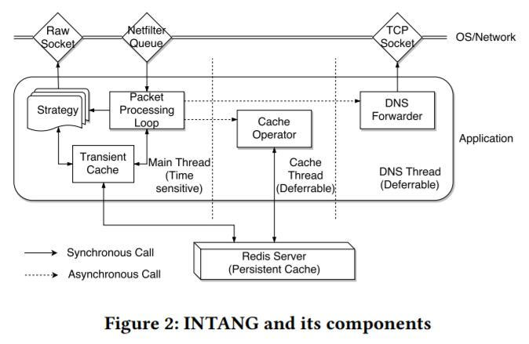
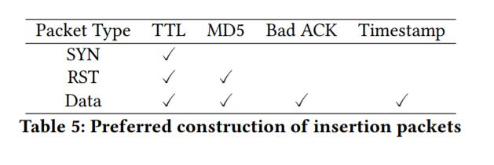

# 你国不是我国：绕过国家级互联网审查


### 摘要

了解你国防火墙（GFW）等国家级互联网审查系统的行为和绕过，已经成为一个引起极大兴趣的研究问题。 绕过的一个方法是开发利用GFW上维护的TCP状态可能不代表终端主机状态的技术。 在本文中，我们可以进行最广泛的关于TCP级GFW绕过技术的测量研究，在你国境内外有几个有利位置，客户可以订阅多个ISP。 我们发现最先进的绕过技术在GFW上不再有效。 我们的研究进一步表明导致这些失败的主要原因是GFWover时间的演变。 此外，其他因素（例如从客户端到服务器的路由中存在中间设备）也会导致先前意外的行为。

我们的测量研究使我们对GFW和新的绕过技术有了新的认识。 对我们新的绕过策略的评估表明，我们的新技术提供了更高的成功率（与先前的方案相比）≈90％或更高。 我们的结果进一步证实了我们对GFW演化行为的新理解。 我们还开发了一个测量驱动工具INTANG，它可以系统地查找并找到适用于服务器和网络路径的最佳策略。 我们的测量结果表明，INTANG可以产生接近完美的绕过率，并且非常有效地帮助各种协议，例如HTTP，DNS TCP和Tor，来避开GFW。

### 关键字

审查绕过，TCP，流量操纵，中国防火墙，INTANG

### ACM 引用格式

```
Zhongjie Wang, Yue Cao, Zhiyun Qian, Chengyu Song, and Srikanth V. Krishnamurthy. 2017. Your State is Not Mine: A Closer Look at Evading Stateful Internet Censorship. In Proceedings of IMC ’17. ACM, New York, NY, USA, 14 pages. https://doi.org/10.1145/3131365.3131374
```
## 一、引言

如今，互联网审查和监视普遍存在。 国家层面的审查系统，如NSA的PRISM和你国的防火墙（GFW），能够实时分析全国的TB级流量。 具有明文的协议（例如，HTTP，DNS，IMAP）直接受到管理者[1,2,5,14,20,29]的监视和操纵，而具有加密的协议（例如，SSH，TLS / SSL， PPTP / MPPE）和Tor，可以通过流量指纹识别，导致后续的IP层阻塞[13,31]。

这些审查系统背后的关键技术是深度包检测（DPI）[27]，它也为网络入侵检测系统（NIDS）提供支持。 正如之前报道的那样，大多数审查NIDS都部署在主干和边界路由器的“路径上”[27,29,34]。

为了检查应用程序级有效负载，DPI技术必须正确实现TCP等底层协议，这是当今Internet的基石。 Ptacek等 [23]已经表明，任何NIDS本身都无法始终以与其终端相同的方式重建TCP流。 其根本原因是在终端主机和NIDS上TCP（以及可能的其他）协议的实现之间存在差异。 即使NIDS完美地反映了一个特定TCP实现的实现，它仍然可能在处理由另一个TCP实现生成的数据包流时出现问题。

由于封包处理中的这种模糊性，发送方可以发送精心设计的封包，使NIDS维护的TCP控制块（TCB）与接收方的TCB不同步。在某些情况下，甚至可以欺骗NIDS以完全停用TCB（例如，在接收到伪RST封包之后），有效地允许对手“操纵”NIDS上的TCB。审查监控器存在同样的基本缺陷 - 如果审查监控器上的TCB可以与服务器上的TCB成功去同步，则客户端可以绕过审查。与其他审查绕过技术（如VPN，Tor和Telex [32]）不同，它依赖于额外的网络基础设施（例如，代理节点）[27]，基于TCB操作的绕过技术只需要在客户端上制作/操纵数据包并且可以帮助所有基于TCP的应用层协议“保持在雷达之下。”基于这个想法，Khattak等人  [17]通过研究其在TCP和HTTP层的行为，探讨了针对GFW的几种实际绕过技术。西厢项目[25]提供了一个实用工具，实施了一些绕过策略，但自2011年以来已停止发展;遗憾的是，在我们的测量研究中，没有一种策略被发现有效。除了这些尝试之外，没有最近的数据点，显示这些绕过技术如何在野外发挥作用。

在这项工作中，我们广泛评估了针对GFW的TCP层审查绕过技术。 通过在你国境内分布在9个城市（和3个ISP）的11个有利位置进行测试，我们能够覆盖各种网络路径，可能包含不同类型的GFW设备和中间设备（详见第3.3节）。我们测量TCB操纵 如何帮助HTTP，DNS和Tor绕过GFW。

首先，我们测量现有的审查绕过规则如何在实践中发挥作用。 有趣的是，我们发现由于意外的网络条件，来自网络中间盒的干扰，或更重要的是GFW的新更新（与之前考虑的模型不同），其中大多数不再适用。 这些初始测量结果促使我们构建探测测试，来推断“新”更新的GFW模型。 最后，基于新的GFW模型以及在部署TCP层审查绕过方面遇到的其他实际挑战的经验教训，我们制定了一套新的绕过策略。 我们的测量结果表明，新策略具有90％或更高的绕过成功率。 我们还评估了这些新策略如何帮助HTTP，DNS，Tor和VPN绕过GFW。

此外，在我们的测量研究过程中，我们设计并实施了审查绕过工具INTANG，整合了本文考虑的所有审查绕过策略; INTANG易于扩展来包含其他策略。 它不需要配置并在后台运行来帮助正常流量绕过审查。 我们计划开源这个工具，来支持这方面的未来研究。

我们总结了我们的贡献如下：

+   到目前为止，我们使用TCP层审查绕过技术执行GFW行为的最大测量研究。 

+   我们证明现有策略要么不起作用，要么在实践中受到限制。 

+   我们根据测量结果开发出更新且更全面的GFW模型。 

+   我们提出了可以绕过新模型的新的，以测量为导向的策略。 

+   我们测量改进策略在HTTP，DNS，VPN和Tor的审查绕过方面的成功率。 结果显示非常高的成功率（> 90％）。 

我们开发了一个开源工具，可以自动测量GFW的响应能力，以及审查绕过。该工具可扩展为一个框架，用于整合未来研究中可能出现的其他绕过策略。## 二、背景

在本节中，我们提供了GFW采用的基于DPI的审查技术的背景，并讨论了先前提出的绕过策略。

### 2.1 路径上的审查系统

“路径上”审查系统窃听由审查员控制的ISP的路由器，即时复制数据包并与正在进行的流量并行执行分析。 相反，“路径内”审查系统将设备作为路由的一部分，分析流量，然后将其传递到下一跳。 “路径上”系统的能力包括读取封包和注入新封包，而“路径内”系统也可以丢弃和/或修改封包。 对于“路径上”系统，处理时间并不重要，因此，它可以进行更复杂的分析; 对于“路径内”系统，至关重要的是不要执行会导致数据包延迟的繁重分析。 像GFW这样的大规模审查系统通常采用“路径上”设计，以确保极高的吞吐量。

要使用DPI检查应用程序层内容，像GFW这样的审查系统需要首先从数据包中重新组装TCP流。据报道[17]，GFW有一个简化的TCP实现来重建TCP数据流并将其传递给上层进行进一步分析。 GFW能够分析广泛的应用协议（例如，HTTP，DNS，IMAP），并且可以应用其基于规则的检测引擎来检测敏感的应用内容。 TCP连接重置是一种多功能的审查技术。由于GFW的“路径上”性质，它不能丢弃一对终端主机之间的非预期封包。相反，它可以注入数据包来强制连接关闭，或中断连接建立。一旦检测到任何敏感内容，GFW就会向相应的客户端和服务器注入RST（类型1）和RST / ACK（类型2）数据包，来中断正在进行的连接并在一段时间内维持中断（90秒），根据我们的测量）。在此期间，两个终端主机之间的任何SYN数据包都将触发GFW中序列号错误的伪造SYN / ACK数据包，这将阻碍合法握手;任何其他数据包都会触发伪造的RST和RST / ACK数据包，这会破坏连接。

根据以前的工作[3,25]和我们的测量，RST（类型-1）和RST / ACK（类型-2）可能来自通常一起存在的两种类型的GFW实例。 我们遇到过一些单独出现类型1或类型2重置的情况; 因此，我们能够分别测量它们的特征。 类型1复位仅设置RST标志，随机TTL值和窗口大小，而类型2复位设置RST和ACK标志，并循环增加TTL值和窗口大小。

一旦检测到敏感关键字，GFW就会发送一个类型1的RST和三个类型为2的RST / ACK，序列号为X，X + 1460和X + 4380（X是当前服务器端序列号）\*。 请注意，在90秒后续阻塞期间，只有类型2复位需要伪造的SYN / ACK数据包; 此外，当我们将HTTP请求拆分为两个TCP数据包时，只能看到类型2重置。 综上所述，我们推测类型2重置来自更高级的GFW实例或设备。

许多研究都集中在GFW的TCP连接重置上。 徐等人。 [34]执行测量来确定注入RST封包的检查设备的位置。 Crandall等人 [11]采用潜在语义分析来自动生成最新的审查关键字列表。 Park等 [20]在HTTP请求和响应上衡量RST数据包注入对关键字过滤的有效性，并提供了为什么基于HTTP响应的过滤已经停止的见解。 执行TCP连接重置确实存在缺点。 例如，跟踪每个连接的TCP状态并将关键字与大量TCP数据包匹配是很昂贵的。 它也不能完全抵抗绕过。

DNS中毒是GFW使用的另一种常用技术[4,5,19]。 GFW通过UDP和TCP审查DNS请求。 对于带有黑名单域的UDP DNS请求，它只会注入虚假的DNS响应; 对于TCP DNS请求，它转向连接重置机制。 我们的测量还涵盖TCP上的DNS。

### 2.2 NIDS 和审查系统的绕过

Ptacek等 [23]以NIDS构建和维护TCP状态的方式，系统地研究了NIDS的漏洞。 特别地，NIDS为每个实时连接维护TCP控制块（TCB）来跟踪其状态信息（例如，TCP状态，序列号，确认号等）。 目标是复制两个重点上存在的完全相同的连接信息。 但是，在实践中，由于以下因素，这非常具有挑战性：

主机信息的多样性。 由于TCP规范的模糊性和更新，不同的OS实现在处理TCP封包时可能具有非常不同的行为。 例如，当遇到意外的TCP标志组合时，不同的操作系统可能表现不同（因为如何处理这些仍然未在标准中指定）。 另一个例子是RST数据包处理在不同的TCP标准（RFC 793到RFC 5961）上发生了巨大变化。

网络信息的多样性。 NIDS通常无法了解其保护的端点的网络拓扑，因为拓扑本身可能会随时间发生变化。 对于LAN，NIDS可以探测和维护拓扑。 然而，对于审查系统，如果可能的话，监控整个互联网的大规模是极具挑战性的。 此外，这样的系统将不会意识到网络故障或封包丢失。 因此，它无法准确判断数据包是否已到达目的地。

中间设备的存在。 NIDS通常不知道任何一对通信端点之间可能遇到的其他中间设备。 在NIDS处理它们之后，这些中间设备可能会丢弃甚至改变数据包，这使得更难以推断接收器的行为方式。

这一观察推动了TCP重置攻击绕过的工作。 例如，Khattak等 [17]在的TCP和HTTP层手动制定了一套相当全面的针对GFW的绕过策略，并在有限的环境中使用固定的客户端和服务器成功验证了它们。 不幸的是，存在许多未被考虑的因素（例如，在不同的网络路径上可能遇到不同类型的GFW设备，各种中间设备可能通过丢弃精心制作的封包来干扰绕过策略）。
## 三、现有绕过策略的测量

基于Ptacek等人概述的NIDS的基本限制。 [23]，由Khattak等人的GFW建模。 [17]，以及西厢项目的实施[25]，我们将基于TCB操纵的审查绕过策略划分为三个高级类别，即（1）TCB创建，（2）数据重组，以及（ 3）TCB拆解。 在本节中，我们进行深入测量，来评估现有绕过策略的有效性，这些策略是基于目前已知的，在这些类别中的GFW模型而开发的。

### 3.1 威胁模型


威胁模型如图1所示。客户端启动与服务器的TCP连接。 GFW通过创建TCB建立影子连接，并且可以从原始连接读取数据包并将数据包注入到原始连接。 同时，路径上可能有网络中间设备。 我们将客户端和GFW之间的中间设备称为客户端中间设备，将GFW和服务器之间的中间设备称为服务器端中间设备。

### 3.2 现有绕过策略

当前绕过策略（下面列出）的目标是，通过发送特制的数据包，特别是“插入”数据包，使GFW和服务器进入不同的状态（即，变得不同步）。 这些插入数据包是精心设计的，以便它们被预期的服务器忽略（或永远不会到达服务器），但是由GFW接受和处理。

TCB创建。 根据以前的工作[17]，GFW在看到SYN数据包时创建TCB。 因此，客户端可以发送带有伪/错序列号的SYN插入包，以在GFW上创建错误的TCB，然后构建真实连接。 由于其“意外”序列号，GFW将忽略实际连接。 操纵插入数据包中的TTL（生存时间）或校验和，来防止服务器接受第一次注入的SYN - 具有较低TTL值的数据包将永远不会到达预期的服务器并且具有错误校验和的数据包将 被服务器丢弃。

数据重组。数据重组策略有两种情况：（1）无序数据重叠。不同的TCP实现以不同的方式处理重叠的无序数据片段。以前的工作[17]表明，如果GFW遇到两个具有相同偏移和长度的无序IP片段，它更喜欢（记录）前者并丢弃后者。但是，对于具有相同序列号和长度的无序TCP段，它更喜欢后者（详见[17]）。IP分段的这种特性可以如下利用。首先，有意地在有效载荷中留下间隙，并且发送包含随机垃圾数据的具有偏移X和长度Y的片段。随后，发送包含敏感关键字的具有偏移X和长度Y的实际数据来避开GFW（因为期望GFW选择前一个封包）。最后通过发送偏移量为0和长度为X的实际数据来填补间隙。为了利用GFW对TCP段的处理，我们只需切换垃圾数据和实际数据的顺序。

（2）有序数据重叠。 当两个携带IP或TCP片段的有序数据包到达时，GFW和服务器都将接受携带特定片段（由偏移/序列号指定）的第一个有序包。 然后，可以制作包含垃圾数据的插入数据包，来填充GFW的接收缓冲区，同时使服务器忽略它们。 例如，可以制作具有小TTL或错误校验和的插入数据包; 这些数据包要么永远不会到达服务器或被服务器丢弃，而是由GFW接受和处理。

TCB拆解。 根据已知模型，GFW预计会在看到RST，RST / ACK或FIN数据包时拆除它维护的TCB。 可以制作这样的数据包来导致TCB拆解，同时操纵诸如TTL或校验和的字段来确保服务器上的连接是活动的。

### 3.3 实验建立

我们在中国，9个不同的城市（北京，上海，广州，深圳，杭州，天津，青岛，张家口，石家庄）拥有11个有利位置，并跨越3个ISP。其中9个使用云服务提供商（Ailyun和Qcloud），另外两个使用家庭网络（中国联通）。这些服务器选自Alexa全球顶级网站。我们首先筛选出受IP阻止，DNS中毒影响或位于中国境内的网站。出于两个原因，我们排除了默认使用HTTPS的网站。首先，GFW目前没有审查HTTPS流量;因此，我们可以在不使用任何反审查技术的情况下自由访问它们。其次，如果我们使用HTTP访问这些HTTPS网站，他们会发送HTTP 301响应来将我们重定向到HTTPS，并将敏感关键字复制到响应的Location头字段。我们发现某些路径上的GFW设备实际上可以在响应数据包中检测到这一点。这类似于[20]中测量的HTML响应审查。此外，假设部署在特定独立系统（AS）中的GFW设备通常具有相同的类型和版本，并配置相同的策略，我们只从每个AS中选择​​一个IP，以便通过跨越大量AS，使我们的实验多样化。通过应用基于上述规则的过滤器，并删除一些缓慢或无响应的网站，我们最终获得了77个网站（来自所考虑的77个AS）的数据集，Alexa排名在41到2091之间。我们手动验证这些网站是否可（在中国以外）访问，并且一旦包含敏感关键字（即ultrasurf，在HTTP请求中），就会受到GFW的TCP连接重置会受到影响。对于每个策略和网站，我们重复测试50次并找到平均值。由于GFW会在检测到任何敏感关键字时封禁一对主机90秒，因此我们会在必要时在测试之间添加间隔。

### 3.4 结果

我们在2017年4月和5月，衡量现有策略绕过GFW的有效性。结果总结在表1中。表示法：我们在表1中使用以下表示法：成功意味着我们从服务器接收HTTP响应并没有接收来自GFW的重置数据包。 失败1意味着我们没有从服务器收到HTTP响应，也没有从GFW收到任何重置。 失败2意味着我们从GFW接收重置封包，即RST（类型-1）或RST / ACK（类型-2）。结果。 我们的研究结果总结如下。


+   我们发现，可能是因为GFW超载，即使我们不使用任何绕过策略，在检索敏感内容方面仍然有2.8％的成功率。 有趣的是，这种行为最初是在2007年记录的[11]并且一直持续到现在。 

+   我们发现使用SYN创建TCB通常不起作用，并且具有高“失败2”几率（大约89％）。 

+   关于数据重组，我们发现（a）乱序数据重组策略具有高“失败1”和高“失败2”几率，但（b）发送有序数据来预先填充GFW的缓冲区，产生了更高的成功率（通常 > 80％）。 

+   具有FIN的TCB拆除具有高“失败2”速率，而具有RST或RST / ACK的TCB拆除成功率约为70％，但有25％的机会触发来自GFW的重置数据包。

GFW的演变。 我们认为，许多现有策略产生高失败率的主要原因是之前的工作[17]中假定的GFW模型不再有效。 虽然我们推迟了模型如何演变的详细讨论到下一部分，但我们在此指出GFW仍然没有验证“校验和”字段，即具有错误校验和的数据包仍然是一个很好的插入数据包（ 如果没有来自网络中间设备的干扰，GFW考虑它来更新其TCB但服务器丢弃它。 这些策略失败的其他原因，我们将分解结果，并在下面进行分析。

来自客户端中间设备的干扰。 客户端中间设备可能会丢弃我们的插入数据包。 由于我们操纵包字段（例如，错误的校验和，没有TCP标志等），使服务器或服务器端中间设备丢弃插入包，因此客户端中间设备也可以丢弃它们。 因此，这些策略无效，并将导致“失败2”。

另一方面，部署在网络客户端的某些NAT或状态/序列检查防火墙，可能会拦截并接受插入数据包并更改其维护的连接状态。 在这种情况下，后来的数据包不会通过这些中间设备，导致“失败1”。例如，如果RST数据包断开它遍历的客户端中间设备上的连接，则中间设备会阻止该连接上的数据包。

一些客户端中间设备可能会丢弃IP片段（wrt数据重组策略）并导致“失败1”。其他将其缓冲并重新组合成一个完整的IP数据包，这可能会导致“失败2”，具体取决于中间设备的实现。

我们从我们所有的11个有利位置探测客户端中间设备，试图连接我们自己的服务器。 如表2所示，我们发现无法使用阿里云的6个客户端发送IP片段。 人们可以在合理的范围内得出结论，阿里云已经配置其中间设备来丢弃某些类型的IP片段。 我们发现来自其他5个节点的连接遇到了客户端中间设备，它们将IP片段重新组合成包含原始HTTP请求的完整IP数据包; 因此，GFW一定捕获了这些分组。 由于我们发现大多数路由器和/或中间设备干扰IP层操作，我们认为这不是普遍适用于绕过的TCP层操作。


天津中国联通的有利位置有客户端中间设备，丢弃带有错误TCP校验和或不包含TCP标志的数据包; 因此，这两种策略在那个地方并不起作用。 最后，我们发现Aliyun有时会丢弃FIN插入数据包，而QCloud有时会丢弃RST插入数据包。 石家庄和天津（中国联通）的客户都有客户端中间设备，丢弃FIN插入数据包。

失败的其他原因。 两种类型的故障可能还有其他一些原因。 网络或服务器故障虽然很少发生。 我们对失败案例进行了微观研究，并列出了我们在下面观察到的案例。

服务器实现的变化。 我们发现，对于某些服务器实现（例如，3.8之前的Linux版本），服务器有时会接受不带TCP标记的“有序数据重叠策略”下的数据包，从而导致“失败1”。 对于“无序数据重叠策略”，服务器可能会接受垃圾数据并丢弃正确的数据包（就像GFW一样）。

网络动态。 由于路由是动态的并且可能会意外更改，因此插入数据包中用于阻止它们到达服务器的TTL值可能不正确。 因此，它们可能会到达服务器并中断连接（失败1）。 在其他情况下，插入数据包可能无法到达GFW并导致“失败2”。我们还发现网络上的数据包丢失可能会影响插入数据包并导致“失败2”。我们通过每隔20ms重复发送插入包三次，来应对这种动态。

总结。 我们的测量使用真实的Web服务器而不是对照服务器来表示每日Web浏览的情况。 结果证明了由许多因素引起的复杂性（例如，中间设备干扰，服务器多样性，网络多样性等）。 我们用现有的绕过策略展示了整体成功率，并列举了失败案例的可能原因。 为了完全解决导致失败的因素，并量化每个因素的影响，需要进行更深入的分析和对照实验（例如，使用[18]中的对照重放服务器），我们将其留作将来的工作。
## 四、GFW行为的演变  

正如§3中所提到的，即使我们消除了中间设备，服务器实现和网络动态的影响，也具有高故障率。 为了理解根本原因，我们仔细研究并认为这是由于演变的GFW行为破坏了许多先前的假设。 根据我们的测量结果，我们假设这些新行为如下。 为了验证这些假设，我们在第7节中设计并广泛评估了新的绕过策略。

先前假设1：GFW仅在看到SYN数据包时才创建TCB。 

为了测试这个假设，我们使用了我们控制下的客户端和服务器对，并执行部分TCP 3路握手（例如，有意省略SYN，SYN / ACK和/或ACK），然后执行带有敏感关键字的HTTP请求。 如果在GFW上创建了正确的TCB，则HTTP请求将触发来自它的TCP重置数据包。 首先，我们的结果证实GFW在看到[...]中描述的SYN数据包时仍会创建TCB。 第二个也是更有趣的是，我们发现GFW在没有看到SYN数据包而是SYN / ACK数据包时也会创建一个TCB。 我们推测GFW已经发展到将此功能用于抵消SYN数据包丢失。 鉴于这些，我们假设GFW表现出以下新行为。

假设的新行为1：GFW不仅在接收到SYN数据包时，还在SYN / ACK数据包时创建了TCB。 

先前假设2：GFW使用第一个SYN数据包中的序列号来创建TCB，并在TCB的生命周期内忽略稍后的SYN数据包。

该假设基于GFW模仿正常TCP实现的基本原理。 我们仔细观察发现它没有。 从第3节中的结果可以看出，在大多数情况下，使用SYN插入数据包创建TCB失败了。 这导致我们重新审视这个案例。 我们发送多个SYN数据包，其中只有一个具有“真实”序列号，然后发送敏感的HTTP请求。 但是，无论我们放置“真正的”SYN数据包，GFW总能检测到后来敏感的关键字。 我们假设这可能是由于以下三个原因中的任何一个：

（1）GFW建立多个TCB，每个SYN包一个; （2）GFW进入“无状态模式”，在其中检查每个单独的数据包（并检查敏感的关键字）而不是首先重新组装数据; （3）GFW使用HTTP请求中的序列号重新同步其TCB。

为了检查（1），我们将HTTP请求中的序列号设置为SYN封包中的序列号的“窗口外”值; 但是，我们发现GFW仍然可以检测到关键字。 为了检验（2），我们将敏感关键字分成两半，每个关键字本身都不是敏感关键字; 但是，我们发现GFW仍然可以检测到它。 对于（3），在发送HTTP请求之前，我们发送一些带有“假”序列号的随机数据，然后我们发送带有“真”序列号的HTTP请求; 在这种情况下，GFW无法检测到它。 这表明GFW将其TCB与随机数据中的序列号重新同步，因此，由于其窗口外序列号，忽略了后来的HTTP请求。 这验证了假设（3）GFW在看到多个SYN封包时进入“重新同步状态”。 我们在第7节进一步验证了这一点。

除了多个SYN数据包之外，我们发现多个SYN / ACK数据包或具有错误确认号的SYN / ACK数据包也会导致GFW进入重新同步状态。

接下来，我们尝试找出“GFW在重新同步状态下使用哪个数据包重新同步其TCB。”从上一个实验中，我们了解到GFW使用从客户端到服务器的数据包重新同步。 因此，我们尝试使用从服务器到客户端的数据包; 此外，我们在两个方向上尝试没有数据的纯ACK数据包。 我们发现这些数据包都不会影响GFW。 但是，我们发现从服务器到客户端的SYN / ACK数据包可以导致重新同步。 我们承认我们发现的案例可能不完整，但很难列举这些案例的详尽集合。 然而，我们的测量结果使我们更好地理解GFW行为，而不是现在的情况，并引导我们进入以下新假设。

假设的新行为2：GFW进入我们称之为“重新同步状态”的状态。以下三种情况下，它使用从服务器到客户端的下一个SYN / ACK数据包中的信息或从客户端到服务器的数据包重新同步其TCB：（a）它看到来自客户端的多个SYN数据包，（b）它看到来自服务器端的多个SYN / ACK数据包，或者（c）它看到一个SYN / ACK数据包，确认号不同于来自SYN数据包中的序列号。

先前的假设3：当GFW看到RST，RST / ACK或FIN数据包时，它会拆除TCB。

§3中的结果表明，演进的GFW通常不会仅仅在看到FIN数据包时拆除TCB。与此同时，我们还使用RST和RST / ACK插入数据包观察到高于20％的高失败率。仔细观察表明，这可能是由于“假设的新行为2”。更具体地说，我们发现当GFW处于新发现的“重新同步状态”时，其TCB有时不能用RST或RST /ACK数据包来拆除。为了验证这一点，我们使用上述技术之一强制GFW进入重新同步状态，然后立即发送RST数据包和带有敏感关键字的HTTP请求。但是，GFW有时仍然可以检测到它。我们使用多对客户端和服务器在不同时间重复该实验，并且发现在不同时间的不同测量之间存在不一致。总体成功率大约为80％，对于特定的客户端 - 服务器对，GFW的行为通常在某个时期内是一致的（尽管并非总是跨时期）。我们目前无法发现背后的明显原因;我们推测这是由于所遇到的GFW类型的不同，以及不同GFW实例和中间设备之间的交互的复杂性。我们在第8节进一步讨论。

此外，我们进行了大量测量，其中我们在3次握手的SYN / ACK和ACK数据包之间，以及3次握手之后发送了RST数据包。 我们发现在这两种情况下，TCB有时不会被拆除，但RST数据包导致GFW进入重新同步状态; 此外，我们发现前一种情况更常发生（差异的确切原因仍然未知）。 这些观察结果导致了以下新的假设。

假设的新行为3：在接收到RST或RST / ACK封包时，GFW可以进入重新同步状态而不是拆除TCB。
## 五、绕过的新方法

本节中，我们将从两个角度讨论绕过的新机会。 首先，基于GFW的新假设行为，我们提出了新的绕过策略。 其次，我们尝试系统地发现新的插入数据包（除了错误的校验和或小TTL）。

### 5.1 GFW 的去同步

首先，我们描述了一个构建块来对抗GFW中的重新同步状态。 它有助于支持我们的新绕过策略，下面将对此进行讨论。 具体来说，当我们期望GFW处于重新同步状态（这可以被强制）时，我们发送一个插入数据包，其序列号在窗口外。 一旦GFW与该插入封包中的序列号同步，它将感知，该连接的后续合法封包具有窗外的序列号，因此被GFW忽略。 我们说现在GFW与连接失去同步。 请注意，服务器会忽略插入数据包，因为它包含窗口外序列号。

使GFW失去同步极大地有助于改进“TCB拆解”和“有序数据重叠”策略，该策略仍然相对较好地工作但偶尔会遇到不希望的高“失败1”和“失败2”几率。

### 5.2 新的绕过策略

我们的绕过策略主要基于利用新发现的GFW状态。 我们提出了两个新的绕过策略以及对两个现有策略的改进\*。我们在第7节中对这些策略进行了广泛的评估。这两个新策略如下：

> 为简洁起见，我们仅在本节中描述新策略，并将改进策略的详细讨论留给§7。

Resync + Desync。 为了强制GFW进入重新同步状态，客户端在3次握手后发送SYN插入数据包。 随后，客户端发送包含窗口外序列号的1字节数据包，来使GFW去同步。 然后是真实请求。 注意，在接收SYN / ACK封包之前不能发送SYN插入封包，因为GFW最终将基于SYN / ACK的ACK号重新同步预期的客户端序列号。 此外，SYN插入数据包应该采用服务器的预期接收窗口之外的序列号（在较旧的Linux中，这可能导致连接重置）。 较新版本的Linux永远不会接受这样的SYN数据包，无论其序列号如何，只会响应质询ACK [7]。 此外，我们可以在服务器或中间设备干扰的情况下制作具有小TTL的SYN插入数据包。

TCB逆转。如上所述，GFW目前仅审查从客户端到服务器的流量（例如，HTTP / DNS请求），并且除少数情况外，已停止对HTTP响应的审查[20]。当GFW第一次看到SYN / ACK时，它假定源是服务器而目的地是客户端。它创建了一个TCB来反映这种情况。它现在将监视从服务器到客户端的数据包（错误地认为它正在监视从客户端到服务器的数据包）。要利用此属性，客户端将首先发送SYN / ACK插入数据包。它稍后以正常方式执行TCP三次握手。 GFW将忽略这些握手包，因为已存在用于此连接的TCB。请注意，必须谨慎制作SYN / ACK插入数据包。在正常情况下，服务器以RST响应，导致GFW拆除原始TCB。为了解决这个问题，需要在插入封包中使用一个差异（例如，较低的TTL）。另外，我们指出来自客户端的SYN / ACK和后续SYN数据包不会触发GFW进入重新同步状态。

### 5.3 新的插入数据包

所有GFW绕过策略都需要注入额外的数据包或修改现有的数据包来破坏GFW上维护的TCP状态[17,23]。 插入数据包特别方便，因为它们最适合支持针对GFW的绕过策略。 正如§3中所提到的，插入数据包可能很难制作。 它们可能由于诸如网络动态，路由不对称，模糊的网络中间设备以及服务器TCP堆栈的变化等诸多原因而失败。 我们的观察是没有一个插入包是普遍好的。 这促使我们发现附加插入封包，它可能对现有插入封包适合且互补。

发现插入数据包的理想解决方案是为GFW，服务器和网络中间件获取精确的TCP模型，这些模型可以送入自动推理引擎（查看哪种类型的数据包可以作为插入数据包）。 但是，由于GFW是一个只有一个可观察反馈属性（即RST注入）的黑盒子，因此很难准确，完整地推断其内部状态。 我们在§4中推断的演化GFW模型也不太可能完整。 因此，即使有人去掉网络中间设备，问题也非常具有挑战性。

我们的解决方案如下：我们首先使用“忽略”路径分析来建模服务器（例如，流行的Linux和FreeBSD TCP堆栈），而不是试图准确地模拟GFW。 我们的意思是，我们想要识别和推理服务器TCP实现中的点，这会导致它忽略收到的数据包。 具体来说，对于传入数据包，我们会分析在响应中发送ACK时，导致数据包被完全丢弃，或“忽略”的所有可能的程序路径。 第一种情况的示例是具有不正确校验和的封包； 第二种情况可以是具有窗口外序列号的数据包，其触发重复的ACK [21]。 在两种情况下，主机（服务器）的TCP状态（例如，下一个预期的序列号）保持不变。 在我们推导出这个服务器模型后，我们用它来开发针对GFW的探测测试。

对于Linux等开源操作系统，这可以通过类似于PacketGuardian [8]中所做的静态分析来实现。 挑战在于手动识别发生“忽略”事件的所有程序点。 一旦识别出忽略路径，就需要计算导致每条路径的限制，并用于引导针对GFW的测试封包。 一旦我们确定了GFW“接受”数据包的情况，即GFW根据数据包中的信息更新其TCB，我们就可以得出结论，这些数据包是有效的插入数据包（请注意，我们尚未考虑来自网络中间设备的干扰）。

在分析期间，我们只需要考虑仍有可能接收数据的TCP状态，即TCP_LISTEN，TCP_SYN_RECV，TCP_ESTABLISHED。例如，我们省略了TIME_WAIT状态，因为服务器无法再以此状态接收数据，因此理解其忽略路径是徒劳的。在为每个TCP状态生成服务器的忽略路径之后，我们首先生成一系列导致特定TCP状态的数据包；然后，对于为每个忽略路径生成的限制集，我们生成一个或多个测试包（作为候选插入包）。注意，每个忽略路径将产生服务器忽略数据包的原因的唯一原因（例如，错误的校验和或无效的ACK，但不是两者都有）。 Ptacek等 [23]使用类似的方法来研究FreeBSD TCP堆栈，遗憾的是它太旧而不适用。相比之下，我们研究了最新的Linux TCP堆栈，它有许多新的行为。此外，我们通过修剪无关TCP状态中的许多“忽略”路径，诸如TIME_WAIT之类，来改进方法，以及关联“忽略”情况与中间设备行为。

作为演示，我们对Linux内核版本4.4进行了这样的分析。 在表3中，我们列出了确认的情况，其中Linux忽略了数据包，但GFW没有。 我们还尝试将服务器状态与GFW状态进行比较，以使差异更加清晰。 请注意，这是一个比之前的报道更完整的列表[17,23]，证明了我们系统分析的优势。 例如，该发现包括两个新的插入包：


1）服务器在TCP_RECV状态下忽略具有错误ACK号的RST / ACK封包，但GFW将接受这样的封包并将其状态改变为TCP_LISTEN（先前状态终止）或TCP_RESYNC，这取决于GFW模型。

2）服务器忽略带有未经请求的MD5报头的数据包（如果之前没有协商可选的MD5认证），GFW将正常处理该数据包。

可以在具有任何TCP标志的插入数据包中利用MD5报头[15]差异。 例如，这可以用在RST数据包中，来拆除GFW上的TCB，或者用在数据包中来欺骗GFW改变其维护的客户端序列号。 请注意，我们故意省略数据重叠分析（用于处理无序和重叠数据包）的差异，因为已经了解不同的操作系统可能采用不同的策略[23]，因此它可能无法产生安全的插入数据包。

与网络中间件交叉验证。即使根据我们的实验，由分析产生的插入数据包工作得很好，它们也可能不适合中间设备。请注意，IP层错误（例如错误的IP校验和，IP可选标头和IP标头长度）可以在所有TCP标志下用于所有TCP标志，但具有此类属性的数据包通常会被路由器或中间设备丢弃。我们发现唯一有用的特征是“IP总长度”大于“实际数据包长度”（表3中列出）；但是，具有此特征的数据包仍可能被某些中间设备检查和删除。甚至利用TCP层差异的插入数据包（例如与不正确的TCP报头长度，或错误的TCP校验和有关的数据包）仍可能被中间设备丢弃，尤其是在干扰适用于所有TCP状态和标志的情况下。唯一的例外是利用未经请求的MD5标头的插入数据包；我们在实验中遇到的中间设备从未丢弃过这些内容（大概是因为它需要一个有状态的防火墙中间设备才能理解何时应该删除这些数据包）。

插入数据包的其余部分仅对数据包有用。 有效的控制包不能用这些来制作; 例如，当服务器处于ESTABLISHED状态时，即使RST / ACK具有错误的ACK号或旧时间戳，它仍然能够成功重置连接。 根据我们的实验，我们没有遇到过丢弃带有意外的MD5选项，旧时间戳或不正确的ACK号的封包的中间件。

其他TCP堆栈的交叉验证。 很难（如果可能的话）彻底测试所有部署的TCP堆栈的忽略路径。 我们交叉验证了Linux内核4.4与其他几个流行的Linux版本的忽略路径，包括4.0,3.14,2.6.34和2.4.37。 我们在这里总结了结果：

在Linux 3.14中，当连接处于ESTABLISHED状态时，将忽略带有SYN标志的传入数据包，而新的GFW模型将接受它。

在Linux 2.6.34和2.4.37中，当连接处于ESTABLISHED状态时，不会忽略没有设置ACK标志的传入数据包。 相反，实际上将接受没有ACK标志的数据包。 这表明这样的插入数据包不适用于较旧的Linux版本。 

在Linux 2.4.37中，不会忽略带有未经请求的MD5标头的传入数据包。 这是因为较旧的Linux版本尚未实现RFC 2385 [15]中提出的特征。 仔细检查后，可以通过内核编译选项关闭服务器上的MD5选项检查，因此相应的插入数据包实际上可能并不总是有效。

这表明大多数插入数据包适用于各种Linux操作系统，但有一些小的例外（如果遇到的Linux版本太旧）。 由于Linux在服务器市场占主导地位[26]，我们设想在这些插入数据包之上构建的绕过策略将运行良好。 实际上，正如我们在§7中所示，如果我们正确利用这些插入数据包，我们的GFW绕过成功率非常高。 为了发现其他差异并执行自动“忽略路径”分析，我们计划在将来使用选择性符号执行（例如，S2E [9]）。 在我们今后的工作中，我们将对其他Linux版本和操作系统的TCP堆栈进行更严格的分析，包括Windows Server等闭源操作系统。
## 六、INTANG

第3节和第4节中描述的所有策略，都集成在统一的测量驱动的一个审查绕过工具中，我们称之为INTANG\*。 该实现包含大约3.3K行的C代码和一些用Python编写的分析脚本。 INTANG被设计为支持附加策略的可扩展框架。 INTANG的组件如图2所示。

> <https://github.com/seclab-ucr/INTANG>



概述。 INTANG的功能分为三个线程，即主线程，缓存线程和DNS线程。 主线程是时间敏感的，所有耗时的操作都被推送到另外两个线程。 主线程运行一个数据包处理循环，它使用netfilter队列[6]拦截某些数据包，并使用原始套接字注入插入数据包。 在处理封包时，它们被保存在队列中，即，在处理完成之前不发送。

当启动新连接时，INTANG根据到特定服务器IP地址的历史测量结果（借助于缓存）选择最有希望的策略。 成功完成试验后，它会将策略ID与连接的四元组一起缓存在内存中。 当它稍后接收到与四元组相关的进一步数据包时，它将调用策略的回调函数来处理传入和传出数据包。 通常，只有一小组特定数据包（例如SYN / ACK数据包，HTTP请求）与每个策略相关并需要监控（如前所述）。

DNS转发器。 DNS线程是一个专用线程，旨在将UDP的DNS请求转换为TCP的DNS请求。如第2.1节所述，TCP层绕过不仅有助于绕过对HTTP连接的审查，还可以支持GFW绕过DNS中毒。为此，在INTANG中集成了一个简单的DNS转发器。它将每个UDP的DNS请求转换为TCP的DNS 请求，并将其发送到未受污染的公共DNS解析器（可能在你国境外）。我们对承载DNS请求和响应的TCP连接应用相同的策略集，来防止GFW在检测到请求中的敏感域时重置连接。主线程拦截传出的DNS UDP请求，这些请求可能包含敏感域名，并将此类请求重定向到执行转发的DNS线程。收到DNS TCP响应后，它将转换回DNS UDP响应并由应用程序正常处理。因此它对应用程序完全透明。我们用Alexa的前100万个域名探测GFW，使用与[12]中相同的方法生成中毒域名列表。

策略。 每个绕过策略规定了特定的拦截点（即，要拦截的封包的类型）以及在每个点处采取的相应动作（例如，注入插入封包）。 通过在作为拦截点而注册的回调函数中实现新逻辑，可以从我们的基本策略套件中导出新策略。 策略可以决定是接受还是丢弃截获的数据包，还可以修改数据包。 它也可以制作和注入新的数据包。

缓存。 INTANG使用Redis [24]作为内存中的键值存储。 Redis提供了理想的功能，如数据持久性，事件驱动编程，键的有效期等。我们还在主线程中维护一个使用链表和哈希表实现的LRU缓存（以减少线程间或进程间通信通常涉及的，Redis存储访问延迟）。 缓存使我们能够了解针对不同网站的策略的有效性，并快速收敛到最佳策略。 当然，为了对抗网络或服务器中的更改，缓存记录仅在到期前保留一段时间。 出于简洁，我们省略了缓存管理的细节。
## 七、评估

我们现在使用§5和我们的工具INTANG中描述的新策略，广泛地评估§4中讨论的GFW的假设新行为。我们使用相同的11个有利位置和77个Web服务器，如§3中所述；除非另有说明，否则所有其他测量设置保持不变，来确保结果的一致性。实验是在2017年4月和5月期间进行的。此外，由于GFW不仅审查出站流量，还审查入站流量（均为客户端到服务器流量）\*，我们在你国境外的4个有利位置进行测量，即：在美国，英国，德国和日本，使用亚马逊EC2上的实例，目标是你国境内的。该数据集包括从同一Alexa的前10,000个网站中选择的前33个你国网站，使用与第3.3节相同的方法，除了它们在你国境内。通过双向评估，我们希望检查我们的新假设/策略是否适用于两个方向，并且GFW在两个方向上的实施/策略是相同的。

> 这样做的可能原因可能是实现双向信息障碍，例如审查外人可以看到的东西或限制某些服务，例如VPN。

### 7.1 绕过 HTTP 审查

我们在本小节中评估了4种基本策略。 这些包括基于先前策略的两种改进策略。 这些仍然有效，但有很高的“失败1”和“失败2”几率。 具体来说，它们是带有RST和有序数据重叠的TCB拆解。 另外两个是新策略，即Resync-Desync和TCB Reversal。 请注意，后面这些策略明确地利用了仅存在于演化GFW模型中的新特征。 我们结合了它们与适用于旧GFW模型的上述现有策略，以便击败GFW模型（即，无论是否遇到旧的GFW模型或演化模型，或两者兼顾，目标都是击败GFW）。

使旧策略健壮。 我们通过在其中集成 §4中提到的“去同步数据包”，使TCB拆解与RST策略更加健壮。 我们在RST数据包之后和合法HTTP请求之前发送此去同步数据包，来解决GFW由于RST数据包而进入“重新同步状态”的情况。 我们使用更精心选择的插入数据包，来减少来自中间设备的潜在干扰，或者因为命中了服务器，我们提高了有序数据重叠策略的可靠性。

考虑新旧GFW模型。 我们结合Resync-Desync策略与带有SYN策略的TCB 创建。 后者可以通过导致创建错误的TCB来绕过旧的GFW模型，而前者可以通过首先强制它们进入重新同步状态，来使演化的GFW模型失去同步。 具体来说，如图3所示，我们将发送两个SYN插入数据包（两者都有错误的序列号），一个在合法的三次握手之前，一个在之后，然后是一个去同步数据包，然后是HTTP请求。 注意，合法SYN后面的第一个SYN插入数据包，也会导致演化的GFW进入重新同步状态。 但是，它稍后与SYN / ACK数据包重新同步。 因此，在握手之后我们需要另一个SYN插入封包，使演化的GFW设备“重新转换”到重新同步状态。


我们结合TCB逆转策略与带RST的TCB拆解策略。 具体来说，如图4所示，我们首先从客户端向服务器发送伪SYN / ACK封包，来在演进的GFW设备上创建错误的TCB。 接下来，我们建立合法的3次握手，由于现有TCB这对于进化的GFW无效。 然后我们发送一个RST插入数据包来拆除旧GFW模型上的TCB，然后是HTTP请求。

避免来自中间件或服务器的干扰。 在制作“插入”数据包时，我们明智地选择插入数据包，以免受到来自中间盒的干扰，并且不会在服务器上产生副作用。 我们主要使用基于TTL的插入数据包，因为它通常适用。 这里的关键挑战是选择准确的TTL值来击中GFW，而不是击中服务器端中间设备或服务器。 我们首先使用类似于tcp traceroute的方式测量从客户端到服务器的跳数。 然后，我们从测量的跳数中减去一个小的δ，以尝试阻止插入数据包到达（命中）服务器端中间盒或服务器。 在我们的评估中，我们启发式地选择δ= 2，但是INTANG可以迭代地将其改变来收敛到良好的值。

此外，我们利用新的MD5和旧时间戳插入数据包，允许绕过GFW而不会干扰中间设备或服务器。 表5总结了我们如何为每种类型的TCP数据包选择插入数据包。



结果。 我们首先分析单个绕过策略的结果。 从表4可以看出，所有策略的总体“失败2”率低至1％，这表明（a）我们的新策略在GFW上的成功率很高，（b）我们的假设对于 GFW的演变似乎是准确的。 我们发现失败1和失败2都发生在一些特定的网站/ IP上。 可以假设这是由一些未知的GFW行为或中间设备干扰引起的。 但是，由于这些情况不能持续（非常罕见），我们认为这更可能是由于中间设备干扰造成的。


总的来说，我们发现失败1高几率是整体低成功率的主要原因。 内省的视角表明，由于某些服务器/中间设备接受数据包而不管（错误的）ACK号或MD5选项头的存在，失败1会发生。 此外，由于（a）网络动态或（b）击中服务器端中间设备，所选择的TTL有时是不准确的; 这导致不希望的副作用，增加“失败1”。

此外，我们发现，对于你国以外的有利位置，不幸的是，TTL差异具有明显的缺点。 访问你国的服务器时，GFW设备和所需的服务器通常在几跳之内（有时是共同的）。 因此，插入数据包的TTL值很难收敛，来满足命中GFW而不是服务器的要求。 因此，在这些情况下，使用这种差异可能会导致任何类型的失败。 从表4可以看出，失败1几率和失败2几率的平均值都高于你国境内的有利位置。

最后，由于INTANG可以根据历史结果，为每个服务器IP选择最佳策略和插入数据包，因此我们还在表4中的额外行中，评估了INTANG在你国境内的优势。 它显示了98.3％的平均成功率，展示每个网站和网络路径特定的最佳策略的表现。 这无需进一步优化我们的实现（例如，测量封包丢失和调整插入封包的冗余级别）。

重要结论：虽然我们确实放大了失败的原因，但本节的重要结论是，我们对GFW的新假设行为似乎相当准确，并且新策略在实现绕过GFW的目标方面看似非常有效。 GFW，特别是根据网站和网络路径选择最佳策略时。

### 7.2 绕过 TCP DNS 审查

GFW使用DNS中毒审查UDP DNS请求。它通过注入RST数据包来审查TCP DNS请求，就像它审查HTTP连接一样。因此，我们的绕过策略也可用于帮助绕过TCP DNS审查。如第6节所述，INTANG将UDP DNS请求转换为TCP DNS请求。为了评估我们的策略在绕过TCP DNS审查方面的有效性，我们使用Dyn的2个公共DNS解析器，以及你国的相同的11个有利位置。谷歌的DNS解析器8.8.8.8和8.8.4.4已被GFW IP劫持，因此无法使用。通过使用“改进的TCB拆解与RST策略”重复请求被删除的域（例如，www.dropbox.com）100次，我们得到表6中所示的结果。天津的有利位置成功率低至38 ％和24％。然而，其他地方共同产生了超过99.5％的成功率。有趣的是，我们偶然发现，如果我们通过两个OpenDNS的DNS解析器208.67.222.222和208.67.220.220使用TCP DNS，即使不应用INTANG，我们也不会从任何有利位置受到任何审查。

### 7.3 Tor 和 VPN

Tor因支持匿名通信而闻名[22]，并对审查制度构成严重威胁。 据报道，GFW已经通过被动流量分析和主动探测超过7年来阻止Tor Bridge节点，这并不奇怪[28]。 接下来，我们检查INTANG是否可以帮助掩盖Tor连接。

在我们的实验中，我们首先验证GFW是否以及如何阻止Tor节点。 随后，我们测试INTANG是否可以帮助你国的客户绕过Tor的审查。

我们尝试从你国境内11个相同的有利位置（超过9个城市）（见第3节），作为Tor客户端，访问美国亚马逊EC2上设置的隐藏Tor网桥节点。令人惊讶的是，我们发现有四个有利位置（在北京，张家口和青岛三个城市），Tor与隐藏Tor网桥的连接可以在没有问题的情况下（按原样）运行超过2天，使用定期手动生成的流量。同时，剩余的7个有利位置请求的任何隐藏的桥接节点，触发主动探测[13,31]并立即被GFW阻止，即你国的任何节点都不能再通过任何端口连接到该IP。这与先前报道的非常不同，即GFW仅阻挡该隐藏桥上的Tor端口[31]，并且当Amazon EC2 IP被回收时可能导致额外损害。我们测试了5个不同的隐藏网桥IP，到目前为止没有发现异常。前四个地点的共同特点是它们都在你国北方。因此，我们推测在该区域的路径上很可能不会遇到过滤Tor的GFW节点。

现在，对于Tor连接确实触发审查阻塞的剩余优势地点，我们应用INTANG和“改进的TCB拆卸策略”，每个五次，并且Tor连接的成功率为100％。 我们会在9小时内定期重复这些实验，并能够继续使用Tor桥节点。 这表明：（a）我们假设一些GFW设备已经发展到一个新的模型; （b）INTANG在制定正确的计量驱动的策略来绕过GFW方面非常有效。 我们设想Tor客户端甚至可以在未来整合INTANG，来提高其审查绕过机会。

与Tor类似，帮助用户规避审查的虚拟专用网络（VPN）也是GFW的热门目标。结果表明，GFW使用多种方法来断开VPN [30,33]。它们包括DPI，IP地址阻止，带宽限制等。2016年11月，我们在你国建立了一个openvpn服务器，并在美国使用一个节点作为客户端。根据我们的实验结果，INTANG的初步版本帮助openvpn通过TCP绕过审查，而没有INTANG的openvpn，由于客户端在握手阶段（GFW看似使用DPI）从GFW接收到重置数据包而断开连接。不幸的是，我们最近无法通过PPTP协议或openvpn协议重复这些实验。由于GFW，两种协议都没有出现断线，也没有受到GFW施加的速率限制的影响。不幸的是，我们还不知道导致这种行为变化的原因，我们计划继续监控潜在机会，应用INTANG来提高VPN稳定性。
## 八、讨论

GFW对策。 我们的工作基于GFW的最新发展。 GFW当然可能会进行额外的改进以击败我们的绕过策略，我们承认这是一场军备竞赛。 例如，我们证明GFW在接受RST数据包方面比普通服务器更自由。 检查员可以对RST封包（例如，校验和和MD5选项字段）执行附加检查作为防御。 但这可能会对GFW产生新的绕过攻击（例如，当服务器不检查MD5选项字段时）。 人们还可以利用GFW对网络拓扑的不可知性。 例如，我们可以测量精确的TTL值来绕过GFW而不到达服务器（尽管同时实现准确性和效率也是一个挑战）。

GFW可以做出的另一个潜在改进是，只有在看到服务器的ACK数据包确认了适当的序列号之后，才信任客户端发送的数据包。 但是，这将使GFW的设计和实施变得非常复杂。 总之，我们认为这是一场军备竞赛。 随着GFW的发展，绕过策略也随之发展。 我们认为推出新GFW模型的成本非常高，这种演化将在几个月（如果不是几年）的时间范围内发生，这为绕过策略的开发留下了足够的时间（特别是在利用INTANG这样的工具时）。 例如，一旦GFW演化，将衍生出一个新的GFW模型，并进行“忽略路径”分析，这可能导致产生新的绕过策略。

GFW的复杂性和（有时的）不一致性。在我们自2015年以来对GFW的长期研究中，我们观察到类型1和类型2重置有时会单独发生。例如，在某些日子里，从CERNET北京的有利位置，我们只能观察到1型重置，而在其他日子，两种类型都可以看到。我们的观察表明，两种类型的GFW设备通常一起部署，有时一种是向下部署。此外，我们发现当这两种类型一起工作时会产生一些相当复杂的影响。在2016年5月的一次测量中，我们发现在我们使用新策略绕过2型设备之后，1型GFW设备也会像2型设备那样具有随后的90秒阻塞期（通常不会）。并且当我们不使用策略时，仅可以观察到类型2重置（即，类型1设备不执行90秒的阻塞期）。看起来，2型重置抑制类型1重置。在其他测量期间未观察到这种罕见的行为。此外，在2016年5月和2017年5月，我们观察到RST数据包有时无法拆除GFW上的TCB，使用不同的受控客户端和服务器对。这种不一致的行为可能是由于GFW的不同版本之间的负载平衡，或者由部署在一起的几个GFW设备引起的一些复杂影响。但是，我们无法获得真实情况。我们承认，除了GFW设备本身的黑盒特性之外，我们的测量很大程度上受限于不同版本的GFW设备（甚至中间盒）之间的干扰以及它们的部署方式。我们有兴趣在未来的工作中进一步探索这种复杂性和不一致性。

策略的结合。 GFW是异构的，具有不同的共存版本。 因此，正如我们在本文中所做的那样，有必要将对GFW的不同版本有效的策略结合起来。 只要策略不相互冲突，这通常不是问题。 然而，当采用多种策略时，“失败1”率可能会增加。 这是因为插入数据包的增加，这增加了中间设备干扰或服务器上的副作用的可能性。

道德考虑。 我们所有的实验都经过精心设计，以免对正常的网络运行造成干扰。 所有连接均由我们租用或直接控制的机器建立。 额外的插入数据包只是常规的TCP数据包（有时具有不正确的字段值），可能只是被服务器丢弃。 我们控制每个网站的流量较低，以避免任何意外的拒绝服务。

请注意，INTANG并不保证其所有策略都不可观察。 用户可自行决定是否在审查员的管辖范围内使用INTANG。 然而，在你国，由于严格的审查[16]，“科学上网”和访问谷歌，Facebook等网站已成为一种普遍的需求。 检查员通常会惩罚那些向群众（例如代理/ VPN提供商）提供审查绕过服务的人，而不是惩罚服务的用户。 像INTANG这样的客户端专用工具对于审查员来说更难以追踪和阻挠。
## 九、相关工作

我们已经在整篇论文中提到了各种相关的努力（特别是在第2段）。 他们都专注于评估审查技术或反审查技术，由其他设施辅助，如VPN。

Clayton等人建议忽略GFW发送的RST数据包[10]。 这需要来自服务器端的合作，因此是不切实际的（所有服务器都需要安装补丁才能做到这一点）。 它不会阻止检查员监控用户流量。 因此，我们在工作中没有明确考虑这一点。 如前所述，Ptacek等人 [23]，深入了解当前NIDS的漏洞，这在很大程度上影响了后来在TCP重置攻击绕过方面的努力（包括我们的努力）。 西厢项目[25]是一种审绕过工具，实施了Ptacek等人的理论。 然而，它只是使用两种制作的包来从两个方向拆除GFW上的TCB，现在变得无效。

Khattak等人的研究[17]是我们最相关的工作。 他们的策略及其问题已在第3节中讨论过。此外，我们的测量利用多个有利位置而不是[17]中的一个有利位置。 我们的测量研究发现了与那篇工作GFW的部署和特征的差异。李等人 [18]使用已知TCP / IP插入数据包，测试了三个国家的审查防火墙和DPI设备，并评估了它们的有效性。 相比之下，我们的工作重点是理解和揭示最大和最复杂的审查系统的最新发展（新国家机器），这使我们能够制定新的绕过策略。
## 十、总结

在本文中，我们进行你国GFW的国家级（TCP级）互联网审查绕过的最深入的测量研究。我们的工作分为多个阶段。首先，我们对先前方法进行了大量测量，发现它们不再有效。我们将其原因归结为两个主要原因：（a）GFW已经演变为吸收新行为，（b）客户端和服务器之间的路径中存在可能干扰绕过策略的中间设备。其次，基于所获得的知识，我们假设新的GFW行为并设计出可能在今天绕过GFW的新策略。我们还构建了一个新的，测量驱动的工具INTANG，它可以收敛于给定客户端服务器对的正确绕过策略。在最后阶段，我们对新策略和INTANG进行了广泛的测量，并证明它们在组合时提供接近完美的绕过率，从而验证了我们对GFW今天的国家审查模型的新理解。
## 参考文献

```
[1] Giuseppe Aceto and Antonio Pescapé. 2015. Internet Censorship detection: Asurvey. Computer Networks 83, C, 381–421. https://doi.org/10.1016/j.comnet.2015.03.008
[2] Daniel Anderson. 2012. Splinternet Behind the Great Firewall of China. Queue10, 11, Article 40, 10 pages. https://doi.org/10.1145/2390756.2405036
[3] Anonymous. 2009. Evaluation and Problems of Intrusion Detection System. (2009).Retrieved August 7, 2017 from http://www.chinagfw.org/2009/09/gfw_21.html
[4] Anonymous. 2012. The Collateral Damage of Internet Censorship by DNSInjection. ACM SIGCOMM Computer Communication Review 42, 3, 21–27.https://doi.org/10.1145/2317307.2317311
[5] Anonymous. 2014. Towards a Comprehensive Picture of the Great Firewall’sDNS Censorship. In 4th USENIX Workshop on Free and Open Communications on the Internet (FOCI ’14). USENIX Association, San Diego, CA. https://www.usenix.org/conference/foci14/workshop-program/presentation/anonymous
[6] Pablo Neira Ayuso. 
[n. d.]. Netfilter Queue Project. (
[n. d.]). Retrieved August 7,2017 from http://www.netfilter.org/projects/libnetfilter_queue/
[7] Yue Cao, Zhiyun Qian, Zhongjie Wang, Tuan Dao, Srikanth V. Krishnamurthy,and Lisa M. Marvel. 2016. Off-Path TCP Exploits: Global Rate Limit ConsideredDangerous. In 25th USENIX Security Symposium (USENIX Security 16).USENIX Association, Austin, TX, 209–225. https://www.usenix.org/conference/usenixsecurity16/technical-sessions/presentation/cao
[8] Qi Alfred Chen, Zhiyun Qian, Yunhan Jack Jia, Yuru Shao, and Zhuoqing MorleyMao. 2015. Static Detection of Packet Injection Vulnerabilities: A Case for IdentifyingAttacker-controlled Implicit Information Leaks. In Proceedings of the 22NdACM SIGSAC Conference on Computer and Communications Security (CCS ’15).ACM, New York, NY, USA, 388–400. https://doi.org/10.1145/2810103.2813643
[9] Vitaly Chipounov, Volodymyr Kuznetsov, and George Candea. 2012. The S2E Platform:Design, Implementation, and Applications. ACM Transactions on ComputerSystems (TOCS) 30, 1, Article 2, 49 pages. https://doi.org/10.1145/2110356.2110358
[10] Richard Clayton, Steven J. Murdoch, and Robert N. M. Watson. 2006. Ignoringthe Great Firewall of China. In Proceedings of the 6th International Conference onPrivacy Enhancing Technologies (PET ’06). Springer-Verlag, Berlin, Heidelberg,20–35. https://doi.org/10.1007/11957454_2
[11] Jedidiah R. Crandall, Daniel Zinn, Michael Byrd, Earl Barr, and Rich East. 2007.ConceptDoppler: A Weather Tracker for Internet Censorship. In Proceedings ofthe 14th ACM Conference on Computer and Communications Security (CCS ’07).ACM, New York, NY, USA, 352–365. https://doi.org/10.1145/1315245.1315290
[12] Haixin Duan, Nicholas Weaver, Zongxu Zhao, Meng Hu, Jinjin Liang, Jian Jiang,Kang Li, and Vern Paxson. 2012. Hold-on: Protecting against on-path DNSpoisoning. In Workshop on Securing and Trusting Internet Names (SATIN).
[13] Roya Ensafi, David Fifield, Philipp Winter, Nick Feamster, Nicholas Weaver, andVern Paxson. 2015. Examining How the Great Firewall Discovers Hidden CircumventionServers. In Proceedings of the 2015 Internet Measurement Conference (IMC’15). ACM, New York, NY, USA, 445–458. https://doi.org/10.1145/2815675.2815690
[14] Phillipa Gill, Masashi Crete-Nishihata, Jakub Dalek, Sharon Goldberg, AdamSenft, and Greg Wiseman. 2015. Characterizing Web Censorship Worldwide:Another Look at the OpenNet Initiative Data. ACM Transactions on the Web(TWEB) 9, 1, Article 4, 29 pages. https://doi.org/10.1145/2700339
[15] Andy Heffernan. 1998. Protection of BGP Sessions via the TCP MD5 SignatureOption. RFC 2385. https://tools.ietf.org/html/rfc2385
[16] OpenNet Initiative. 2012. China | ONI Country Profile. (2012). Retrieved August7, 2017 from https://opennet.net/research/profiles/china
[17] Sheharbano Khattak, Mobin Javed, Philip D. Anderson, and Vern Paxson. 2013.Towards Illuminating a Censorship Monitor’s Model to Facilitate Evasion. InPresented as part of the 3rd USENIX Workshop on Free and Open Communicationson the Internet (FOCI ’13). USENIX, Washington, D.C. https://www.usenix.org/conference/foci13/workshop-program/presentation/Khattak
[18] Fangfan Li, Abbas Razaghpanah, Arash Molavi Kakhki, Arian Akhavan Niaki,David Choffnes, Phillipa Gill, and Alan Mislove. 2017. lib•erate,(n): A library forexposing (traffic-classification) rules and avoiding them efficiently. In Proceedingsof the 2017 Internet Measurement Conference (IMC ’17). ACM, London, UK. https://doi.org/10.1145/3131365.3131376
[19] Graham Lowe, Patrick Winters, and Michael L Marcus. 2007. The Great DNS Wallof China. Technical Report. https://censorbib.nymity.ch/pdf/Lowe2007a.pdf
[20] Jong Chun Park and Jedidiah R. Crandall. 2010. Empirical Study of a NationalScaleDistributed Intrusion Detection System: Backbone-Level Filtering of HTMLResponses in China. In Proceedings of the 2010 IEEE 30th International Conferenceon Distributed Computing Systems (ICDCS ’10). IEEE Computer Society, Washington,DC, USA, 315–326. https://doi.org/10.1109/ICDCS.2010.46
[21] Jon Postel. 1981. Transmission Control Protocol. RFC 793. https://tools.ietf.org/html/rfc793
[22] The Tor Project. 
[n. d.]. The Tor Project. (
[n. d.]). Retrieved August 7, 2017 fromhttps://www.torproject.org
[23] Thomas H. Ptacek and Timothy N. Newsham. 1998. Insertion, Envasion, andDenial of Service: Eluding Network Intrusion Detection. Technical Report. http://www.icir.org/vern/Ptacek-Newsham-Evasion-98.ps
[24] Redis. 
[n. d.]. The Redis Project. (
[n. d.]). Retrieved August 7, 2017 fromhttp://redis.io/
[25] scholarzhang. 2010. West Chamber Project. (2010). Retrieved August 7, 2017from https://code.google.com/p/scholarzhang/
[26] Zain Shamsi, Ankur Nandwani, Derek Leonard, and Dmitri Loguinov. 2014. Hershel:Single-packet Os Fingerprinting. In The 2014 ACM International Conferenceon Measurement and Modeling of Computer Systems (SIGMETRICS ’14). ACM, NewYork, NY, USA, 195–206. https://doi.org/10.1145/2591971.2591972
[27] Michael Carl Tschantz, Sadia Afroz, David Fifield, and Vern Paxson. 2016. SoK:Towards Grounding Censorship Circumvention in Empiricism. In 2016 IEEESymposium on Security and Privacy (SP). 914–933. https://doi.org/10.1109/SP.2016.59
[28] twilde. 2012. Knock Knock Knockin’ on Bridges’ Doors. (January2012). Retrieved August 7, 2017 from https://blog.torproject.org/blog/knock-knock-knockin-bridges-doors
[29] John-Paul Verkamp and Minaxi Gupta. 2012. Inferring Mechanics of WebCensorship Around the World. In Presented as part of the 2nd USENIX Workshopon Free and Open Communications on the Internet (FOCI ’12). USENIX,Bellevue, WA. https://www.usenix.org/conference/foci12/workshop-program/presentation/Verkamp
[30] VPNanswers.com. 2015. Bypass The Great Firewall And Hide Your OpenVPNIn China. (2015). Retrieved August 7, 2017 from https://www.vpnanswers.com/bypass-great-firewall-hide-openvpn-in-china-2015/
[31] Philipp Winter and Stefan Lindskog. 2012. How the Great Firewall of Chinais Blocking Tor. In Presented as part of the 2nd USENIX Workshop on Free andOpen Communications on the Internet (FOCI ’12). USENIX, Bellevue, WA. https://www.usenix.org/conference/foci12/workshop-program/presentation/Winter
[32] Eric Wustrow, Scott Wolchok, Ian Goldberg, and J. Alex Halderman. 2011. Telex:Anticensorship in the Network Infrastructure. In Proceedings of the 20th USENIXConference on Security (SEC ’11). USENIX Association, Berkeley, CA, USA, 30–30.http://dl.acm.org/citation.cfm?id=2028067.2028097
[33] Eva Xiao. 2016. Behind The Scenes: Here’s Why Your VPN Is Done InChina. (2016). Retrieved August 7, 2017 from http://technode.com/2016/03/17/behind-scenes-heres-vpn/
[34] Xueyang Xu, Z. Morley Mao, and J. Alex Halderman. 2011. Internet Censorship inChina: Where Does the Filtering Occur?. In Proceedings of the 12th InternationalConference on Passive and Active Measurement (PAM ’11). Springer-Verlag, Berlin,Heidelberg, 133–142. http://dl.acm.org/citation.cfm?id=1987510.1987524
```
