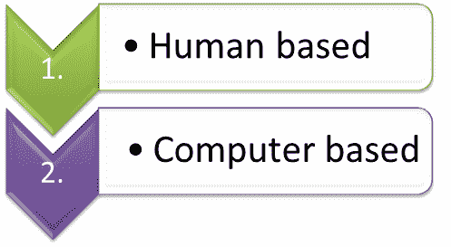
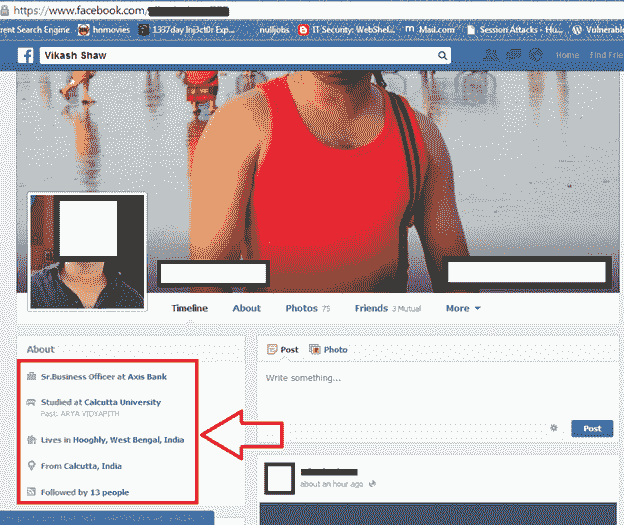
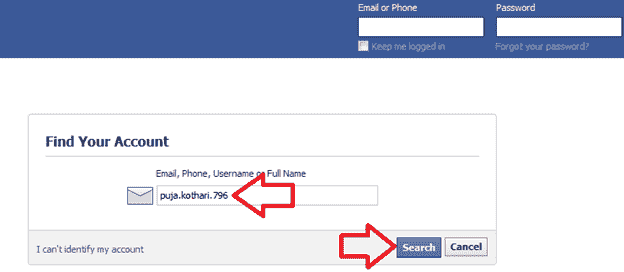
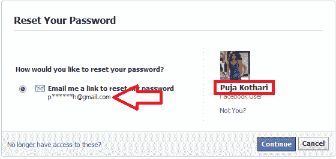
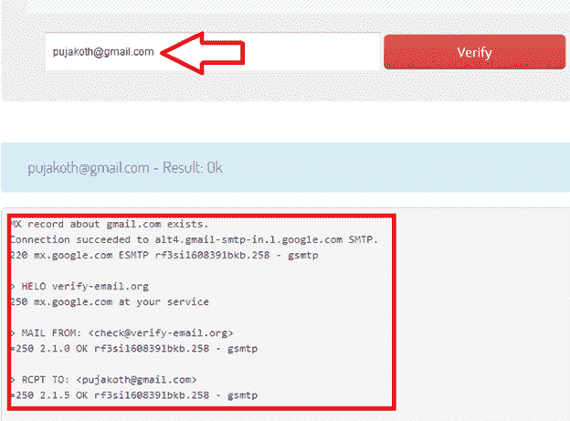
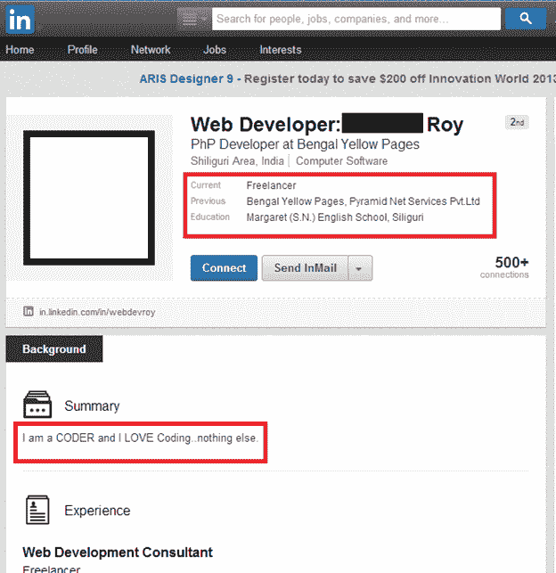
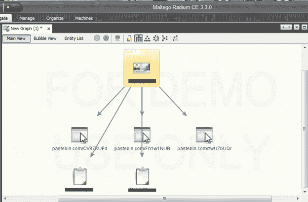
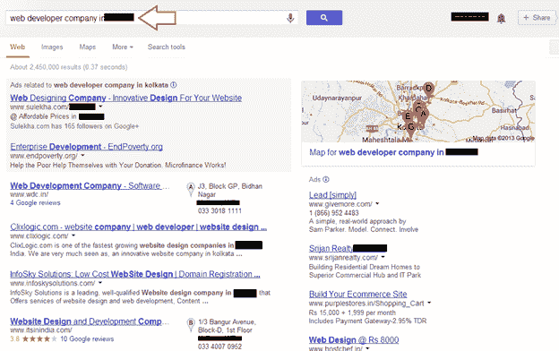
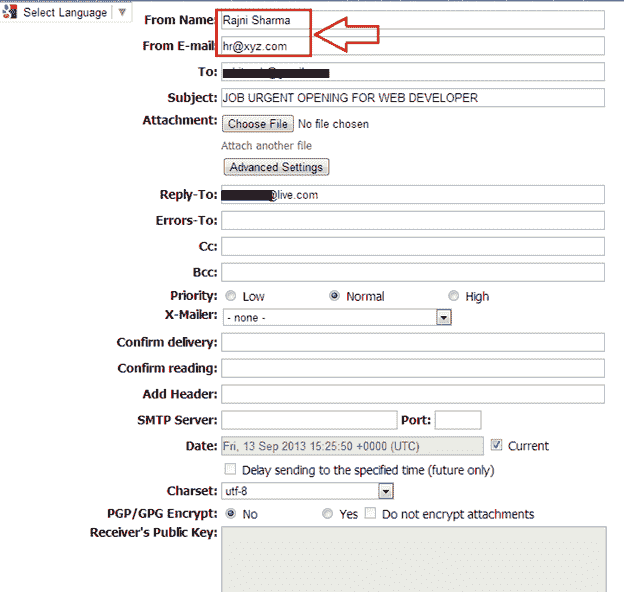
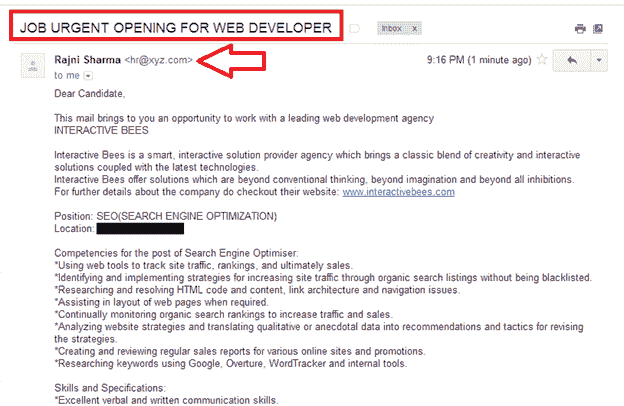

<!--yml
category: 社会工程
date: 2022-11-04 11:54:57
-->

# 关于社会工程学攻击的一次探索（上）-Hacker技术研究及思考-知名技术博客-无名

> 来源：[https://www.6b8.me/index.php?m=home&c=article&a=index&id=17](https://www.6b8.me/index.php?m=home&c=article&a=index&id=17)

在这篇文章中将讨论社会工程学攻击，很明显，首先遇到的问题就是：“什么是社会工程学”和“这些攻击有那些类型”。当然更有趣的是本文中将介绍使用者些技巧的黑客而不是使用像SET的方式攻击。本文的目标是展现一个潜在的黑客使用不同的攻击方式。

　　在信息安全学的背景下，社会工程学是一种操纵相关人员泄露出机密信息的艺术，建立在使人决断产生认知偏差的基础上，有时候这些偏差被称为“人类硬件漏洞”。犯罪分子利用社会工程学的手法进行诱骗，使受害者不会意识到被利用来攻击网络。当人们没有意识到他们拥有的信息的价值，所以并不会特意的保护他们所得知的信息，社会工程学正是利用了这一点。

　　安全在于要明确“谁”和“什么”需要信任:是否在一个合适或不合适的时间去相信一个人说的话;与你交流的人是否是你认定的那个人;当你正在浏览的网站是否是合法的;在电话另一头的人提供给你的信息是否是可以相信的;当你向别人提供自己的信息时，你是否会考虑这是不是安全的。

　　社会工程学攻击通常可以分为两个类型：

　　一、基于人—基于人的社会工程学攻击需要人与人的互动来接触到需要窃取到的信息。这里只介绍几种流行的方法。

**　　1.伪装**

　　在这种攻击方式中，黑客通常会伪装成一个系统的合法用户和员工。黑客此时可以通过伪装成一个看门人、雇员或者客户来获取物理访问权限。

**　　2.冒充重要用户**

　　在这种攻击方法中，黑客会伪装成贵宾、高层经理或者其他有权使用或进入计算机系统并察看文件的人。大多数时候，低级别的员工不会针对这种情况来询问任何问题。

　**　3.冒充第三方**

　　黑客也会伪装成拥有权限的其他人。这种方法通常会在拥有授权的其他人不能使用机器的时候使用。

**　　4.寻求帮助**

　　这是一个经典的社会工程学攻击的方法。向帮助台和技术人员寻求帮助并套取想要的信息，这让他们成为了社会工程学攻击良好的目标。

　**　5.偷窥**

　　当一个人在输入登陆密码时收集他的密码，当然可以通过偷窥的方法。

**　　6.翻垃圾箱**

　　寻找在垃圾箱中记录密码的纸、电脑打印的文件、快递信息等，往往可以找到有用的信息。

　　二、基于计算机—基于计算机的社会工程学的攻击可以使用相关软件来获取所需要的信息

　**　1\. 钓鱼**

　　钓鱼涉及虚假邮件、聊天记录或网站设计，模拟与捕捉真正目标系统的敏感数据。比如伪造一条上来自银行或其他金融机构的需要“验证”您登陆信息的消息，来冒充一条合法的登陆页面来“嘲弄你”。

**　　2.引诱**

　　攻击者可能使用能勾起你欲望的东西引诱你去点击，可能是一场音乐会或一部电影的下载链接，也有可能是你“偶然"间发现的标有“高管薪酬摘要Q1 2013”并标有公司LOGO的U盘。一旦下载或使用了类似设备，PC或公司的网络就会感染恶意软件以便于犯罪分子进入你的系统。

**　　3.在线诈骗**

　　被包含在邮件附件中的恶意软件，一旦被下载使用则很有可能被安装包括能够捕获用户的密码的键盘记录器、病毒、木马甚至蠕虫。又是也有可能弹出“特别优惠”的窗口，吸引用户无意中安装了其他的恶意软件。

　　现在我们来演示一个真实的攻击实例。

　　我假设我的目标的名字是一个“受害者先生”(Mr.Victim 不是真名)，我们将通过一个非常简单的搜索方法—将他的名字放入google来看看我们能得到什么结果。

　　从上面的结果我们可以看到，很多信息都可以通过google来收集。你可以找到目标的Facebook的主页链接甚至是Linkedln和Twitter，还有同名的网站和相关的照片。

　　当然我们也可以通过使用社交网络来收集尽可能多的信息。我们都知道社交网络如Facebook、Twitter、Orkut、Linkedln这种每个人都在使用的社交网络上，我们可以和陌生人交朋友，与他们聊天或分享一些东西。人们通常会认为这些社交网络正在帮助他们让自己加入一个庞大的人际关系网中。而我的观点不是这样，我意识到，这些社交网络是世界上最大的人类信息识别数据库。假设你要收集一个特定的人的信息，现在你可以通过Facebook找到这个人的照片以及他的个人信息，如他的地址、教育背景、家庭成员等。不仅如此，你可以通过这些信息来猜测这个人的性格，并进一步通过他/她更新的状态来了解潜在受害人的个人生活近况。

　　在找到目标精确的信息之后，我们要将视线转向他的好友列表，这会在你的社会工程学攻击中提供帮助。你也可以通过下载所有的图片和他所有的个人信息然后伪造一个假的“他”，然后向他的好友发送请求，并开始与他们沟通。这样一来，你可以得到他更多的信息甚至知道了哪位是他的女友。有时很难真正的目标会隐藏在众多虚假目标里，我发现当我在Facebook的搜索栏中搜索目标的名字，Facebook并没有抓取包含有用户真实姓名的数据库，而是用户名，比如：

　　[http://www.Facebook.com/victim](http://www.Facebook.com/victim)，这里的“victim”就是目标的用户名。

　　这个用户名有利于攻击者预测目标的电子邮件ID。例如：我有这样一个用户名puja.kothari.796现在，我打开Facebook的登陆页面，点击“忘记密码”，会看到这样的选项：

　　现在我们输入我们所知的用户名。

　　现在我们拥有受害者的名字并已知他使用电子邮件，我们可以看到“p”和“h”之间的六颗星号，我们可以使用像[http://verify-email.org](http://verify-email.org)的这种服务来验证邮箱地址可不可能是pujaKoth@gmail.com。

　　Linkedln是一个不同与Facebook的网站。在这里我们可以找到目标工作背景和资历。也可以找出哪些公司曾经雇佣过他。

　　当然我们也可以通过一些工具像:Maltego，Harvester，Creepy等来获取更多的信息。

　　现在假设我们拥有了以下信息(虚构)：

　　姓名：Mr.Victim

　　城市：纽约

　　职业：web开发

　　邮件地址：test@gmail.com

　　现在我知道了他在做什么工作，在哪个城市，如果我提供给他一份一家大公司的工作，我认为他肯定不会拒绝这个机会。现在我伪装成一个需要web开发人员的公司与他联系并提供一份不错的薪水。

　　在上面的图中我们可以看到，我可以选择一家公司，并通过虚假邮件服务以该公司的HR的名义发送假邮件。像：hr@xyz.com

　　现在将此邮件发送给Mr.Victim,让我们来看看在受害者眼里这封邮件是什么样:

　　受到这种邮件后，很多人都会将简历转发给攻击者，简历上当然会包含很多敏感信息。